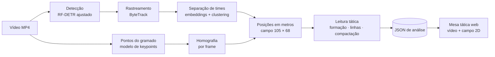
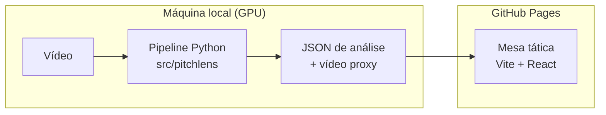

<div align="center">


# PitchLens

**Do vídeo à leitura tática.**<br />
Visão computacional que detecta jogadores, reconstrói o campo em 2D e identifica formação,
linhas e compactação ao longo da partida.

[](https://github.com/lopeslyra10/pitchlens/actions/workflows/ci.yml)
[](https://github.com/lopeslyra10/pitchlens/actions/workflows/deploy-pages.yml)
[](LICENSE)
[](pyproject.toml)
[](web/)

[**Site ao vivo**](https://lopeslyra10.github.io/pitchlens/) ·
[Roadmap](docs/ROADMAP.md) ·
[Decisões (ADRs)](docs/adr/) ·
[Diário de bordo](docs/devlog/)

<br />


</div>

> **In English:** PitchLens is a computer vision project that turns football (soccer) match
> video into tactical insight. It detects players, referees and the ball, tracks them over time,
> projects them onto a 2D pitch through per-frame homography and reads the team shape: formation
> per time window with a confidence score, defensive/midfield/attacking lines, width, depth and
> compactness. Heavy processing runs offline on a local GPU, and the results are published as a
> static, always-on web tactical board. Built in public, phase by phase (see the
> [roadmap](docs/ROADMAP.md)).

## Por que este projeto

Radares 2D de jogadores viraram uma demonstração comum de visão computacional. O PitchLens usa o
radar como ponto de partida e mira na **leitura tática**, respondendo às perguntas que um analista
faria:

- Em que formação o time está agora, e quando ela muda?
- Qual é a altura da linha defensiva e a distância entre os setores?
- O time está compacto ou espaçado? Largo ou estreito?
- Como o desenho muda com e sem a bola?

## Como funciona



| Etapa | O que faz | Fase |
| --- | --- | --- |
| Detecção | Encontra jogadores, goleiros, árbitros e bola em cada frame | 1 |
| Rastreamento | Mantém um identificador estável para cada jogador | 2 |
| Separação de times | Agrupa os jogadores pela aparência do uniforme, sem rótulos manuais | 2 |
| Calibração | Detecta pontos do gramado e estima a homografia de cada frame | 3 |
| Projeção | Converte pixels em metros no referencial do campo | 3 |
| Leitura tática | Formação por janela com confiança, linhas, largura, profundidade e compactação | 4 |
| Mesa tática | Vídeo e campo 2D sincronizados, com linha do tempo e métricas | 5 |

A formação não é calculada quadro a quadro. As posições são suavizadas em janelas de 5 a 10
segundos, normalizadas (time sempre atacando para a direita) e comparadas a modelos de formação
por atribuição ótima, gerando um rótulo com nível de confiança, como `4-3-3 · 82%`.

## Arquitetura

O processamento pesado roda **offline, na GPU local**; o site é **estático** e consome os
resultados como arquivos. Assim a demonstração fica sempre no ar, sem servidor e sem custo
([ADR-0002](docs/adr/0002-processar-offline-visualizar-online.md)).



## Roadmap

| Fase | Entrega | Versão | Status |
| --- | --- | --- | --- |
| 0 | **Fundação:** repositório, documentação, CI/CD e site no ar | v0.1.0 | ✅ Concluída |
| 1 | **Dados e detecção:** fine-tuning do RF-DETR, métricas e comparação com YOLO | v0.2.0 | ⏭️ Próxima |
| 2 | **Rastreamento e times:** ByteTrack, IDs estáveis e separação de times | v0.3.0 | ⚪ Planejada |
| 3 | **Calibração do campo:** keypoints, homografia por frame e radar 2D | v0.4.0 | ⚪ Planejada |
| 4 | **Leitura tática:** formação com confiança, linhas, compactação e mapas de calor | v0.5.0 | ⚪ Planejada |
| 5 | **Mesa tática web:** vídeo e campo 2D sincronizados (MVP) | v1.0.0 | ⚪ Planejada |
| 6 | **Processamento sob demanda:** API, Docker e demo de upload | v1.1.0 | ⚪ Planejada |
| 7 | **Apresentação final e vídeo** | v1.2.0 | ⚪ Planejada |

Detalhes, critérios de pronto e riscos de cada fase estão em [docs/ROADMAP.md](docs/ROADMAP.md).

## Estrutura do repositório

```text
pitchlens/
├── src/pitchlens/      # núcleo Python: geometria do campo e, depois, o pipeline de visão
├── tests/              # testes do núcleo (pytest)
├── web/                # site e mesa tática (Vite + React + TypeScript)
├── docs/
│   ├── ROADMAP.md      # fases, entregas e critérios de pronto
│   ├── adr/            # registros de decisão de arquitetura
│   ├── devlog/         # diário de bordo por fase, base da apresentação final
│   └── assets/         # imagens e GIFs de cada fase
├── data/               # vídeos e datasets (fora do Git, ver data/README.md)
└── .github/workflows/  # CI e deploy no GitHub Pages
```

## Como rodar

**Núcleo Python** (3.11+):

```bash
python -m venv .venv
source .venv/bin/activate        # Windows: .venv\Scripts\activate
pip install -e ".[dev]"
ruff check . && pytest
```

**Site** (Node 22.12+):

```bash
cd web
npm install
npm run dev                      # http://localhost:5173
```

## Documentação do processo

O projeto é construído em público, e o próprio repositório conta a história:

- **[Diário de bordo](docs/devlog/)**: o que foi feito em cada fase, problemas, resultados e
  roteiro para o vídeo.
- **[ADRs](docs/adr/)**: cada decisão importante, com contexto, alternativas e consequências.
- **[Releases](https://github.com/lopeslyra10/pitchlens/releases)**: cada fase fecha com uma tag
  SemVer e imagens do resultado.
- **Commits** seguem Conventional Commits ([CONTRIBUTING.md](CONTRIBUTING.md)).

## Dados e licenças

O código está sob a [licença MIT](LICENSE). Vídeos de partidas, datasets e pesos de modelos não
são versionados; fontes e licenças estão em [data/README.md](data/README.md).

## Autor

**Augusto Lopes Lyra** · [github.com/lopeslyra10](https://github.com/lopeslyra10)
