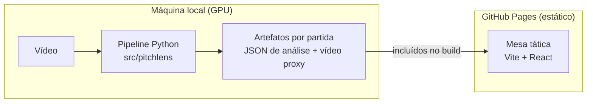

# ADR-0002: Processar offline na GPU local e publicar um site estático

- **Status:** aceito
- **Data:** 2026-09-12
- **Fase:** 0

## Contexto

Detecção, rastreamento e estimativa de pontos do gramado em vídeo exigem GPU. Um projeto de
portfólio, por outro lado, precisa estar **sempre no ar, carregar rápido e custar zero**: quem
avalia não vai esperar um servidor acordar nem enviar um vídeo para ver o resultado.

A arquitetura sugerida no início (FastAPI, Redis, Celery/RQ, PostgreSQL e MinIO em Docker
Compose) é adequada para um produto multiusuário com upload, mas:

- não tem hospedagem gratuita com GPU;
- adiciona cinco serviços antes de existir qualquer resultado para mostrar;
- não melhora a experiência de quem só quer ver a análise.

## Decisão

Separar **processamento** e **visualização**.



1. O pipeline Python roda localmente e gera, para cada partida, um **JSON de análise**
   (posições em metros, times, formações por janela e métricas) e um **vídeo proxy** comprimido.
2. O site é estático (Vite + React) e é publicado no **GitHub Pages** pelo GitHub Actions a
   cada push na `main`.
3. O processamento sob demanda (API, fila e upload) fica para a **Fase 6**, apenas com o
   necessário.

## Alternativas consideradas

| Alternativa | Por que não agora |
| --- | --- |
| API com GPU na nuvem (Modal, RunPod, Replicate) | Custo recorrente e *cold start* de dezenas de segundos |
| Hugging Face Spaces com CPU gratuita | Minutos por clipe; útil apenas como demo opcional de upload (Fase 6) |
| Vercel ou Netlify | Funcionariam, mas o Pages mantém código, CI, deploy e releases no mesmo lugar |

## Consequências

- Site sem backend: custo zero, sem *cold start* e sem segredos para proteger.
- O **contrato de dados** (JSON) vira a fronteira entre as partes e terá versão de schema.
  Rascunho, a ser fechado na Fase 5:

  ```json
  {
    "schema_version": "0.1",
    "match": { "id": "bundesliga-clip-01", "fps": 25, "pitch": { "length": 105, "width": 68 } },
    "frames": [
      {
        "t": 12.4,
        "players": [{ "id": 7, "team": "home", "role": "player", "x": 34.2, "y": 20.1 }],
        "ball": { "x": 50.1, "y": 30.2 }
      }
    ],
    "windows": [
      {
        "start": 10.0,
        "end": 18.0,
        "team": "home",
        "formation": "4-3-3",
        "confidence": 0.82,
        "metrics": { "width": 48.3, "depth": 31.0, "defensive_line": 34.5, "area": 1120.0 }
      }
    ]
  }
  ```

- Vídeos grandes não entram no repositório; o vídeo proxy de demonstração depende da revisão de
  licença prevista no [ADR-0001](0001-fonte-de-video-clipes-bundesliga.md).
- Até a Fase 6 o site não aceita vídeos novos. É uma limitação assumida em troca de custo zero
  e disponibilidade.
