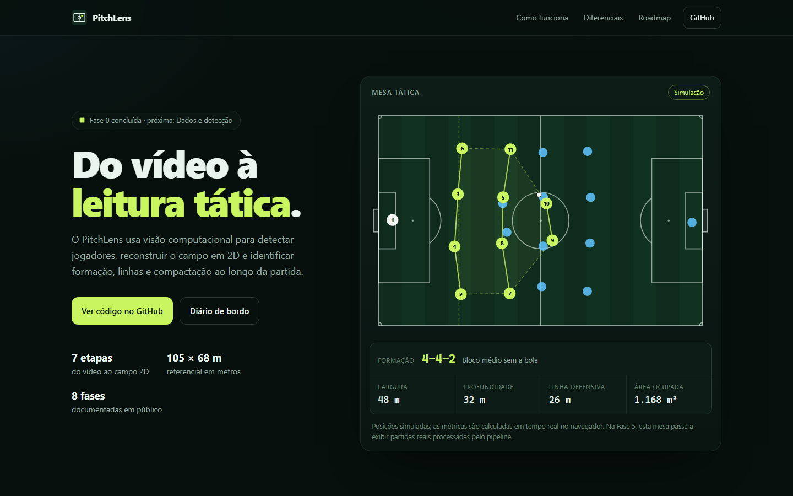

# Fase 0: Fundação

- **Versão:** v0.1.0
- **Data:** 2026-09-12
- **Status:** concluída

## Objetivo

Transformar a ideia em um projeto público, documentado e com deploy automático desde o primeiro
commit, antes de escrever qualquer código de visão computacional.

## Ponto de partida

A ideia nasceu de uma conversa sobre um app que usa visão computacional para analisar o
posicionamento dos jogadores e mostrar o esquema tático, no estilo das "mesas táticas" que se
popularizaram. A proposta inicial trazia:

- um pipeline de detecção (RF-DETR ou YOLO), rastreamento (ByteTrack), separação de times,
  homografia para o campo e análise temporal;
- uma stack de produto completa: FastAPI, Redis, Celery/RQ, PostgreSQL, MinIO, Next.js e
  Docker Compose;
- uma decisão em aberto: câmera tática fixa ou vídeo de transmissão.

## O que foi refinado antes de começar

| Proposta inicial | Ajuste | Motivo |
| --- | --- | --- |
| Radar 2D como produto | Radar como ponto de partida; foco na leitura tática (formação com confiança, linhas, compactação e linha do tempo) | O radar 2D já é uma demonstração comum; o diferencial está na interpretação |
| Usar modelos prontos | Treinar e comparar modelos na GPU local (RF-DETR e YOLO) | Mostra domínio de treino e avaliação, não só consumo de modelos |
| FastAPI, Redis, Celery, PostgreSQL e MinIO desde o MVP | Processar offline e publicar um site estático; backend só na Fase 6 | Hospedagem gratuita, sempre no ar e sem *cold start* ([ADR-0002](../adr/0002-processar-offline-visualizar-online.md)) |
| Next.js | Vite + React + TypeScript | SPA estática centrada em SVG e Canvas ([ADR-0003](../adr/0003-stack-e-organizacao-do-repositorio.md)) |
| Câmera fixa ou transmissão? | Clipes da câmera principal da Bundesliga, com calibração plugável | Dados rotulados disponíveis e resultado mais forte ([ADR-0001](../adr/0001-fonte-de-video-clipes-bundesliga.md)) |

## O que foi feito

- Repositório público com histórico desde o commit zero, Conventional Commits em português e
  versionamento semântico.
- Roadmap em oito fases com critérios de pronto e três ADRs.
- Núcleo Python `pitchlens.pitch`: referencial do campo em metros, 29 pontos de referência para
  a homografia, espelhamento entre os lados e normalização da direção de ataque.
- Site com mesa tática simulada: o time transita entre 4-4-2, 4-1-4-1, 4-3-3, 2-3-5 e 4-2-3-1,
  e largura, profundidade, altura da linha defensiva e área do casco convexo são calculadas em
  tempo real no navegador.
- CI com lint, formatação, testes e build, e deploy contínuo no GitHub Pages.
- Milestones das Fases 1 a 7 e issues da Fase 1 no GitHub.

| Commit | Descrição |
| --- | --- |
| `2d3cc72` | `chore: inicializa o repositório do PitchLens` |
| `21266a3` | `docs: define visão, roadmap e decisões de arquitetura` |
| `52ba03c` | `feat(core): adiciona geometria do campo e sistema de coordenadas` |
| `0945035` | `feat(web): cria site com mesa tática simulada` |
| `569c6ef` | `ci: adiciona pipeline de qualidade e deploy no GitHub Pages` |

## Decisões

- [ADR-0001](../adr/0001-fonte-de-video-clipes-bundesliga.md): clipes públicos da Bundesliga
  como fonte de vídeo do MVP, com calibração plugável para câmera fixa no futuro.
- [ADR-0002](../adr/0002-processar-offline-visualizar-online.md): processar offline na GPU local
  e publicar um site estático.
- [ADR-0003](../adr/0003-stack-e-organizacao-do-repositorio.md): monorepo com núcleo Python e
  site em Vite + React + TypeScript.

## Problemas e soluções

| Problema | Solução |
| --- | --- |
| O disco do sistema tinha menos de 1 GB livre, e é lá que ficam, por padrão, os caches de pip e npm e a pasta temporária | Projeto em outro disco e caches (`PIP_CACHE_DIR`, `npm_config_cache`, `TEMP`) apontados para a pasta `.cache/` do projeto, ignorada pelo Git. O procedimento está no `CONTRIBUTING.md`, porque PyTorch e os pesos dos modelos da Fase 1 ocupam vários GB |
| `npm install --prefix web` leu o `package.json` da pasta errada | Instalação executada de dentro de `web/` |
| O servidor de preview não subia: o caminho `C:\Program Files\nodejs\npm.cmd` era executado sem aspas | Vite chamado diretamente pelo `node` |
| A captura de tela em largura de celular saía cortada | A medição no navegador em 375 px mostrou o documento com exatamente a largura da tela e nenhum elemento vazando. O corte vinha da largura mínima de janela do navegador em modo headless, não do layout |

## Resultados

- **Site:** <https://lopeslyra10.github.io/pitchlens/>
- **CI:** verde em todos os pushes da fase ([histórico](https://github.com/lopeslyra10/pitchlens/actions/workflows/ci.yml)).
- **Deploy:** automático no GitHub Pages a cada push na `main` ([histórico](https://github.com/lopeslyra10/pitchlens/actions/workflows/deploy-pages.yml)).
- **Testes:** 13 no núcleo Python e 26 no site, todos passando.
- **Build do site:** 237 kB de JavaScript (75 kB com gzip).

## Roteiro para o vídeo

Cerca de dois minutos:

1. **Gancho (0:00 a 0:15).** "Radares 2D de jogadores viraram moda. Eu quero ir além: fazer o
   computador ler a tática." Mostrar a mesa tática animada no site.
2. **A ideia e o refinamento (0:15 a 0:45).** Mostrar a tabela "O que foi refinado antes de
   começar" e explicar por que o foco é a leitura tática e por que o processamento é offline,
   com um site estático.
3. **Construído em público (0:45 a 1:20).** Abrir o GitHub: histórico desde o commit zero, ADRs,
   roadmap, milestones e issues da Fase 1.
4. **Qualidade desde o início (1:20 a 1:45).** Mostrar a CI verde (Python e web) e o deploy
   automático no Pages a cada push.
5. **Próximo passo (1:45 a 2:00).** "Na Fase 1, treino o detector na minha GPU e comparo
   RF-DETR com YOLO."

## Próximos passos

Fase 1: dados e detecção ([milestone](https://github.com/lopeslyra10/pitchlens/milestone/1)).

- [#1](https://github.com/lopeslyra10/pitchlens/issues/1) Baixar e organizar os clipes e datasets rotulados
- [#2](https://github.com/lopeslyra10/pitchlens/issues/2) Configurar ambiente de treino com PyTorch e CUDA
- [#3](https://github.com/lopeslyra10/pitchlens/issues/3) Fine-tuning do RF-DETR
- [#4](https://github.com/lopeslyra10/pitchlens/issues/4) Baseline YOLO e comparação de modelos
- [#5](https://github.com/lopeslyra10/pitchlens/issues/5) Inferência em clipe de 30 s com vídeo anotado
- [#6](https://github.com/lopeslyra10/pitchlens/issues/6) ADR-0004: escolha do detector
- [#7](https://github.com/lopeslyra10/pitchlens/issues/7) Fechar a Fase 1 e publicar a v0.2.0
