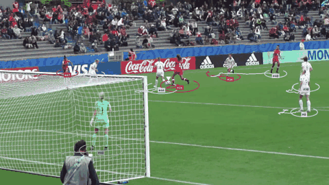

# Fase 2: Rastreamento e times

- **Versão:** v0.3.0
- **Data:** 2026-09-18
- **Status:** concluída
- **Pull request:** [#16](https://github.com/lopeslyra10/pitchlens/pull/16)

## Objetivo

Dar a cada jogador um identificador estável ao longo do vídeo e descobrir o time de cada um
sem nenhum rótulo manual.

## O que foi feito

- **Comando `pitchlens track`:** detecta cada frame uma única vez, aprende as cores dos times
  com uma amostra do vídeo e depois rastreia, atribui os times e gera o vídeo anotado.
- **Rastreamento:** BoT-SORT do pacote `trackers`, com compensação do movimento da câmera.
- **Separação de times:** cor mediana do tronco, ajuste robusto, rejeição de cores distantes e
  voto por identificador. Goleiros entram pelo time mais próximo e a arbitragem fica de fora.
- **Desenho:** cada jogador na cor real do uniforme aprendida do vídeo, com número, rastro de
  1,5 s e texto com contraste para uniformes escuros.
- **Medição sem rótulos:** indicadores de estabilidade dos identificadores e uma folha de
  conferência com 111 recortes numerados.
- **Site:** nova seção "Resultados" com imagem e vídeo reais de cada fase, métricas e créditos
  das licenças.
- **Qualidade:** 82 testes em Python e 31 no site.

## Decisões

- [ADR-0006](../adr/0006-rastreamento-botsort-e-times-por-cor.md): BoT-SORT para rastrear e cor
  do uniforme, com ajuste robusto e rejeição, para separar os times.

## Problemas e soluções

| Problema | Causa | Solução |
| --- | --- | --- |
| 329 identificadores para cerca de 11 jogadoras, com rastros de meio segundo | Câmera na mão, sem compensação de movimento, e detecções fracas cortadas antes do rastreador | BoT-SORT com compensação de câmera e detecções a partir de 0,1: 78 identificadores e rastros de 3,8 s |
| O rastreador usado seria removido | `sv.ByteTrack` obsoleto desde o supervision 0.28 | Troca pelo pacote `trackers`, sucessor oficial |
| Árbitras e reservas eram colocadas num dos times | O k-means com dois grupos não tem a opção "nenhum" | Rejeição de cores fora do raio dos dois uniformes |
| A primeira versão da rejeição não rejeitou nada | As próprias árbitras entravam no aprendizado do time vermelho, escureciam o centro e inflavam o raio | Ajuste robusto: descartar as cores mais distantes antes de recalcular o centro. As trocas de time caíram de 9 para 0 |
| Recortes quase só de gramado ainda davam uma cor | Limite fixo de pixels, que em jogadores grandes aceita recortes ruins | Exigência de uma fração mínima de uniforme no recorte |
| A CI falhou na seção de resultados do site | O `.gitignore` excluía todo `.mp4`, e o clipe do site não foi commitado | Exceção só para `web/public/resultados/`; o teste que confere a mídia pegou o erro antes do deploy |

## Resultados

**Rastreamento** (clipe U-17, 45 s, câmera na mão):

| Configuração | Identificadores | Duração mediana | Rastros < 1 s |
| --- | --- | --- | --- |
| `sv.ByteTrack`, limiar 0,35 | 329 | 0,5 s | 67% |
| ByteTrack (`trackers`), limiar 0,1 | 86 | 3,5 s | 23% |
| **BoT-SORT (`trackers`), limiar 0,1** | **78** | **3,8 s** | 28% |

**Separação de times** (111 recortes conferidos visualmente, sem o voto por identificador):

| Versão | Time certo | Trocas de time | Sem time |
| --- | --- | --- | --- |
| K-means com dois grupos | 98 | 9 | 0 |
| **Ajuste robusto e rejeição** | 102 | **0** | 5 jogadoras encobertas |

Relatório completo, folha de conferência e créditos: [reports/fase-2](../../reports/fase-2/README.md).

## Aprendizados

- **Olhar os dados antes de ajustar.** A rejeição só funcionou depois de medir as distâncias dos
  erros e perceber que eles mesmos contaminavam o centro do time.
- **Abster é melhor que errar.** Uma jogadora sem time num frame é corrigida pelo voto; uma
  árbitra no time errado distorceria as métricas táticas da Fase 4.
- **Dependência obsoleta é dívida.** O aviso de remoção do `sv.ByteTrack` levou a uma
  biblioteca melhor e à comparação entre rastreadores.
- **Testes de conteúdo também pegam erros de infraestrutura.** Um teste simples de "o arquivo
  existe" encontrou uma regra de `.gitignore` antes de o site ir ao ar sem o vídeo.

## Roteiro para o vídeo

Cerca de dois minutos:

1. **Gancho (0:00 a 0:15).** O GIF: "cada jogadora tem um número e a cor do próprio time, e
   ninguém rotulou nada".
2. **O rastreador que se perdia (0:15 a 0:45).** Mostrar o antes e depois: 329 contra 78
   identificadores, e explicar a câmera na mão e as detecções fracas.
3. **Como o computador descobre os times (0:45 a 1:20).** Cor do tronco, gramado ignorado,
   dois grupos. Mostrar a folha de conferência e as árbitras no time errado.
4. **O ajuste que zerou os erros (1:20 a 1:45).** Centro puxado pelo preto da arbitragem,
   ajuste robusto e opção "sem time".
5. **Próximo passo (1:45 a 2:00).** "Na Fase 3, esses pontos saem da imagem e vão para o campo
   em metros."

## Próximos passos

Fase 3: calibração do campo ([milestone](https://github.com/lopeslyra10/pitchlens/milestone/3)).

- Pontos do gramado e homografia, levando pixels para metros.
- Máscara do campo para descartar pessoas fora do gramado (pendência da Fase 1).
- Primeiro radar 2D sincronizado com o vídeo.
- Gravação própria com câmera parada (issue #15, agora na Fase 4).
