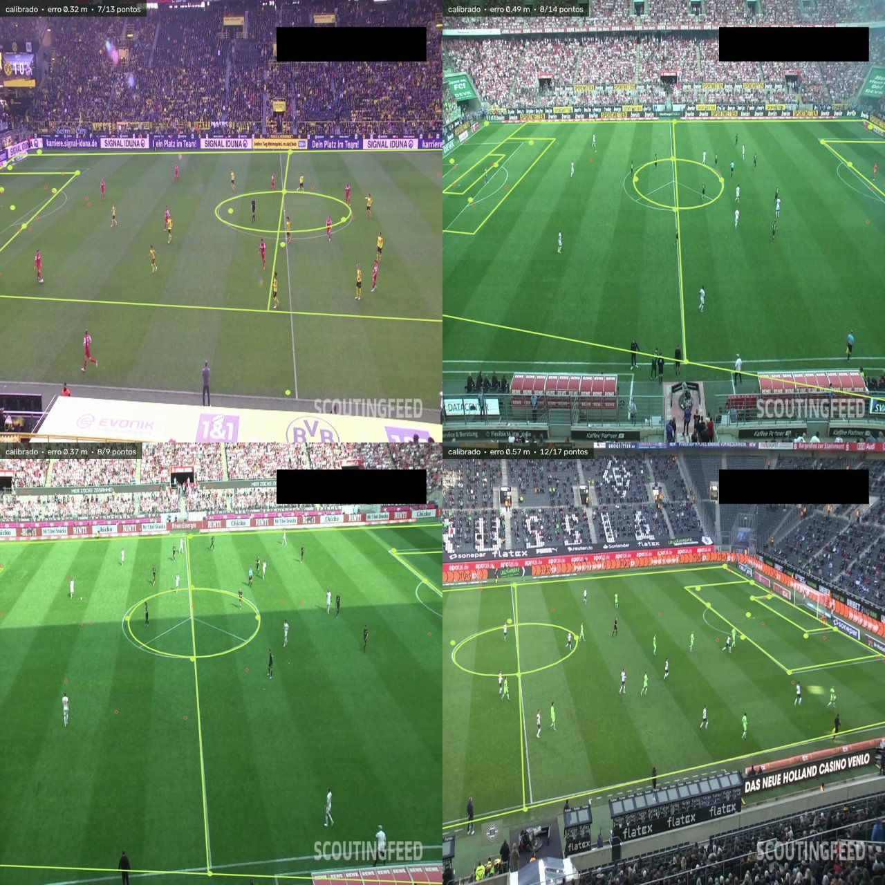
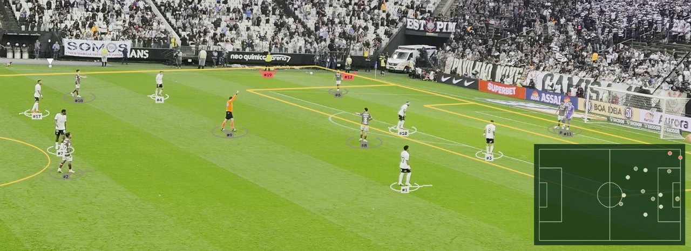

# Fase 3: Calibração do campo

- **Versão:** v0.4.0
- **Data:** 2026-10-03
- **Status:** concluída
- **Pull request:** [#24](https://github.com/lopeslyra10/pitchlens/pull/24)

## Objetivo

Sair dos pixels. Descobrir os pontos do gramado em cada frame, estimar a homografia que leva a
imagem para o campo e medir, em metros, o quanto ela erra.

## O que foi feito

- **Modelo de pontos do gramado:** RF-DETR em modo keypoints, ajustado nos 32 pontos do dataset
  `football-field-detection` (CC BY 4.0, 255 imagens de treino).
- **Homografia em NumPy:** DLT normalizado e RANSAC escritos à mão, determinísticos e sem
  OpenCV, para a CI poder testar o ajuste sem GPU.
- **Suavização e descarte:** suavização na posição dos pontos projetados, detecção de corte de
  câmera pelo erro, repetição da última matriz boa por meio segundo e "sem campo" depois disso.
- **Checagem geométrica:** o campo projetado tem de ser um quadrilátero convexo, na mesma ordem
  e do mesmo lado do horizonte.
- **Máscara do campo:** quem está fora do gramado sai pelo pé, antes do rastreador.
- **Comando `pitchlens calibrate`** e `pitchlens track --pitch-weights`, que acrescenta ao vídeo
  as linhas do campo e o **radar 2D** com os jogadores em metros.
- **Medição:** `scripts/evaluate_keypoints.py` compara o modelo com a anotação, em pixels e em
  metros, com as mesmas exigências que o vídeo usa.
- **Vídeos próprios:** três cortes do Corinthians x Fluminense gravados na arquibancada,
  escolhidos por conteúdo e por estabilidade medida.
- **Qualidade:** 168 testes em Python.

## Decisões

- [ADR-0007](../adr/0007-calibracao-do-campo.md): pontos do gramado por modelo, homografia com
  RANSAC em metros, suavização por pontos, guardas de aceitação e máscara pelo pé do jogador.

## Problemas e soluções

| Problema | Causa | Solução |
| --- | --- | --- |
| O treino "fechou bem" (OKS mAP 0,885) e o modelo não calibrou nenhuma das 28 imagens de teste | A OKS usa a área do objeto como tolerância, e o objeto é o campo inteiro: 50 px de erro ainda pontuam | Medir em metros desde o começo; o erro por ponto (35 px) e as 0 imagens calibradas contaram a verdade |
| O modelo estava subtreinado | `lr` e `lr_encoder` fixados por mim em 2e-5, cinco vezes abaixo do padrão do RF-DETR, e média móvel desligada | Voltar aos padrões e retomar a partir dos pesos já aprendidos: 35 px → 12,8 px e 0 → 27 imagens calibradas, em 1 h 09 |
| O vídeo mostrava "calibrado · 0,39 m" com as linhas fora do lugar | Poucos pontos concordando, todos amontoados: a matriz passa por eles e entorta o resto | Checagem de campo convexo: mantém 27 de 28 no teste e corta 43% dos ajustes tortos na arena |
| O treino morreu de madrugada sem erro nenhum no log | A máquina desligou; o log simplesmente parou | `--resume` desde o início, `scripts/acompanhar-treino.ps1` para ver época, ritmo e há quanto tempo o log não recebe nada |
| O corte com o círculo central calibra só 27% dos frames | Os pontos visíveis ficam quase todos sobre a linha do meio, e pontos quase colineares definem mal uma homografia | Escolher o enquadramento: o corte com a grande área no quadro calibra 92% |

## Resultados

**Split de teste** (28 imagens, dataset de pontos do gramado):

| Pontos usados | Imagens calibradas | Erro mediano | p95 |
| --- | --- | --- | --- |
| **modelo** | 27 de 28 (96%) | **0,51 m** | 0,67 m |
| anotação (teto da geometria) | 28 de 28 | 0,30 m | 0,48 m |

**Vídeos próprios** (cortes de 10 a 12 s, 1080p):

| Vídeo | Frames calibrados | Erro mediano |
| --- | --- | --- |
| `arena-03-jogada` (grande área no quadro) | 92% | 0,37 m |
| `arena-02-area` (grande área e gol) | 83% | 0,33 m |
| `arena-01-circulo` (só o meio-campo) | 27% | 0,43 m |

Relatório completo, tentativas descartadas e créditos:
[reports/fase-3](../../reports/fase-3/README.md).

## Aprendizados

- **A métrica do treino não é a métrica do produto.** Um modelo com OKS mAP 0,885 não calibrou
  nada. A medida em metros foi escrita antes de o modelo existir, e foi ela que deu o veredito.
- **Erro baixo não é calibração certa.** O erro de reprojeção mede a coerência do ajuste com os
  pontos que ele mesmo escolheu. Sem uma checagem independente — a geometria — ele mente.
- **Ler o padrão da biblioteca antes de "ajustar".** Baixar o learning rate parecia prudente e
  custou um treino inteiro.
- **Medir antes de manter.** Duas ideias que pareciam boas no papel (RANSAC em pixels, somar
  pontos de vários frames) pioraram ou não mudaram nada, e foram revertidas em vez de ficarem
  como complexidade morta.
- **O enquadramento faz parte do método.** Filmar a grande área dá uma calibração três vezes
  melhor que filmar o meio-campo, com o mesmo modelo.

## Roteiro para o vídeo

Cerca de dois minutos:

1. **Gancho (0:00 a 0:15).** O radar ao lado do vídeo: "cada jogador vira um ponto na posição
   real em metros — daqui sai tudo que é tática".
2. **O que é uma homografia (0:15 a 0:40).** O gramado é plano; quatro pontos bastam. Mostrar as
   linhas desenhadas caindo em cima das linhas de verdade.
3. **A métrica que mentiu (0:40 a 1:10).** "O treino fechou com 0,885 e o modelo não calibrou
   nenhuma imagem." Explicar a tolerância da OKS e mostrar o número que importa: 0 de 28.
4. **O conserto (1:10 a 1:30).** Learning rate de volta ao padrão, média móvel ligada: 35 px →
   12,8 px, 0 → 27 imagens, em uma hora de treino.
5. **Erro baixo e campo torto (1:30 a 1:50).** O frame com "calibrado · 0,39 m" e as linhas fora
   do lugar, e a checagem de campo convexo cortando 43% desses casos.
6. **Próximo passo (1:50 a 2:00).** "Com as posições em metros, a Fase 4 lê a formação."

## Próximos passos

Fase 4: leitura tática ([milestone](https://github.com/lopeslyra10/pitchlens/milestone/4)).

- Formação por janela de tempo, linhas, largura, profundidade e compactação, tudo em metros.
- Anotar imagens das gravações próprias para fechar a diferença de domínio da calibração.
- Gravação com câmera parada do alto da arquibancada (issue #15).
