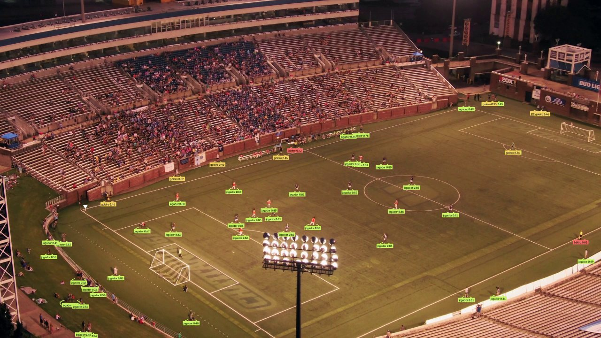
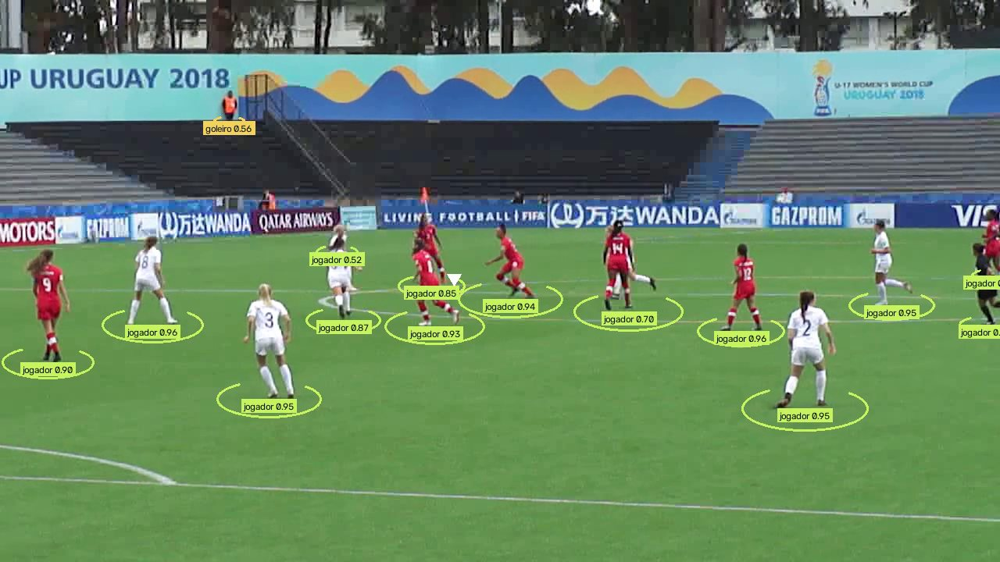
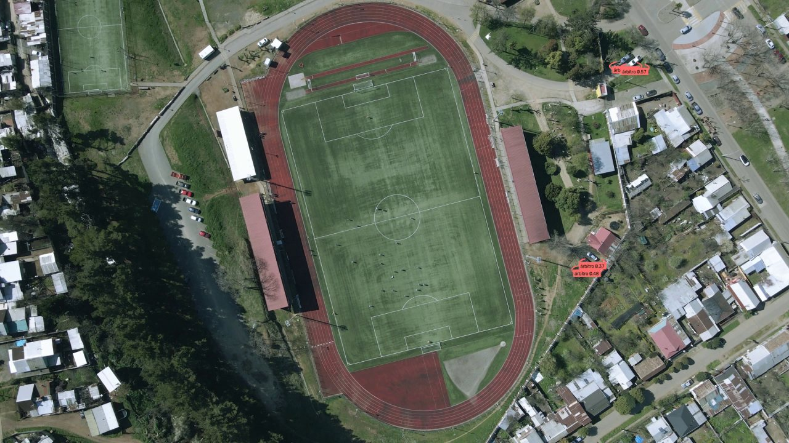

# Relatório da Fase 1: detecção

Resultados gerados pelos scripts do projeto. Os números abaixo vêm dos arquivos desta pasta,
que podem ser recriados com os comandos indicados.

## 1. Comparação entre modelos

`python scripts/evaluate.py --rfdetr runs/rfdetr-medium/checkpoint_best_total.pth --yolo runs/yolo26m/weights/best.pt`

Split de teste do dataset (25 imagens, câmera de transmissão), mesmo avaliador, 1024 px, FP32
na RTX 3060. Detalhes em [comparacao.md](comparacao.md) e [metricas.json](metricas.json).

| Modelo | mAP@50 | mAP@50-95 | AP50 bola | ms/imagem |
| --- | --- | --- | --- | --- |
| RF-DETR Medium | 0,889 | 0,585 | 0,646 | 88,9 |
| YOLO26m | 0,843 | 0,604 | 0,580 | 40,4 |

A escolha do RF-DETR está no [ADR-0005](../../docs/adr/0005-detector-rf-detr-medium.md).

## 2. Fora do ângulo de transmissão

`python scripts/domain_shift.py --weights runs/rfdetr-medium/checkpoint_best_total.pth`

Os vídeos de licença livre não têm anotações, então não há mAP. A comparação usa indicadores
por frame com o mesmo limiar de confiança (0,35): objetos detectados, confiança média e
frações de frames com a bola. Detalhes em [mudanca-de-dominio.md](mudanca-de-dominio.md).

| Fonte | Ângulo | Jogadores/frame | Confiança (jogador) | Frames com bola |
| --- | --- | --- | --- | --- |
| Teste do dataset | Transmissão | 20,0 | 0,87 | 80% |
| `u17-nz-can-25` | Arquibancada baixa | 10,4 | 0,83 | 81% |
| `pexels-2657261` | Estádio, câmera alta | 33,9 | 0,71 | 38% |
| `pexels-28870860` | Drone muito alto | 7,6 | 0,57 | 6% |

**Leitura:**

- **Arquibancada baixa:** o comportamento é praticamente igual ao do teste. Menos jogadores por
  frame porque a câmera mostra só parte do campo.
- **Estádio com câmera alta:** os jogadores em campo são encontrados, mas pessoas fora do
  gramado (banco, barranco, beira da arquibancada) também, o que explica os 34 "jogadores" por
  frame. A máscara do campo, que vem com a homografia da Fase 3, resolve esse caso.
- **Drone muito alto:** os jogadores ficam com poucos pixels e quase não são detectados; os
  poucos acertos são falsos positivos em telhados. Essa altura não serve para o pipeline.

| Estádio, câmera alta | Arquibancada baixa | Drone muito alto |
| --- | --- | --- |
|  |  |  |

Créditos: vídeos do [Pexels](https://www.pexels.com/video/aerial-footage-of-a-game-of-soccer-2657261/)
e de [Benjamin Quezada Arevalo](https://www.pexels.com/video/aerial-view-of-soccer-game-on-green-field-28870860/)
(Licença Pexels). A imagem da arquibancada deriva de
[vídeo de NaBUru38](https://commons.wikimedia.org/wiki/File:2018_FIFA_U-17_Women%27s_World_Cup_-_New_Zealand_vs_Canada_-_25.webm)
e é distribuída sob [CC BY-SA 4.0](https://creativecommons.org/licenses/by-sa/4.0/).
